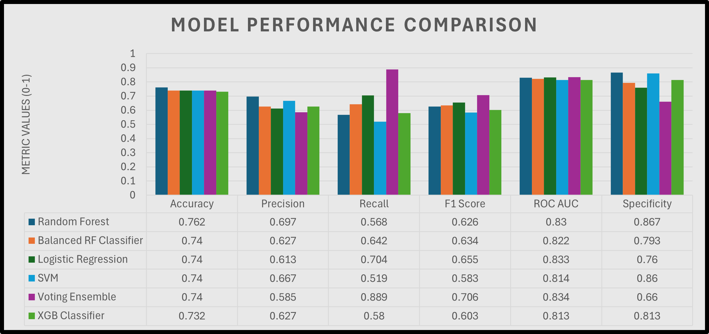
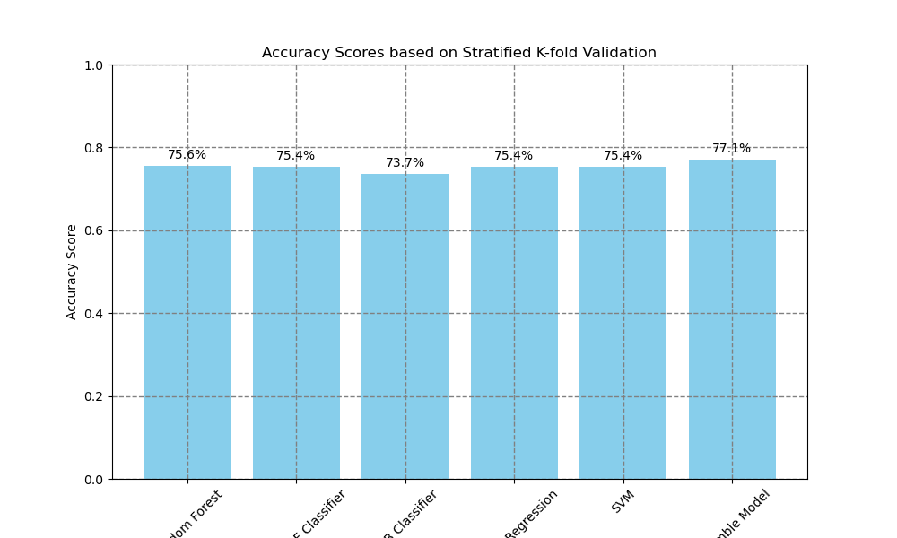
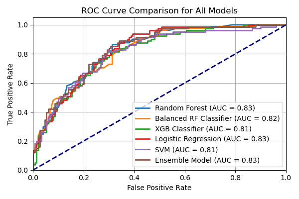
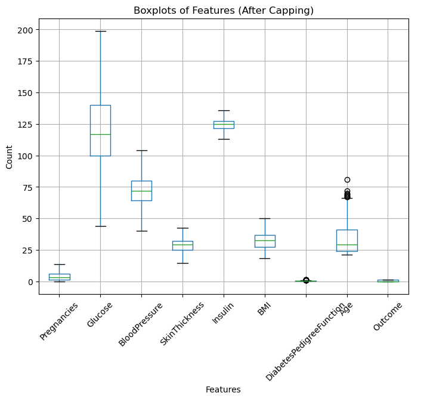
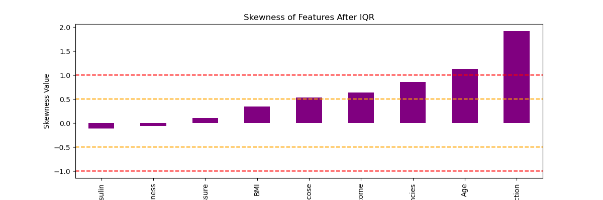
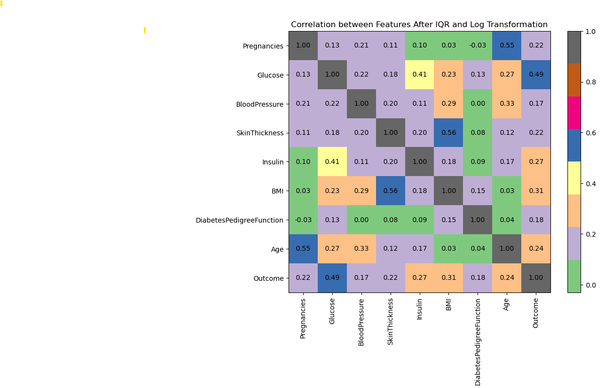
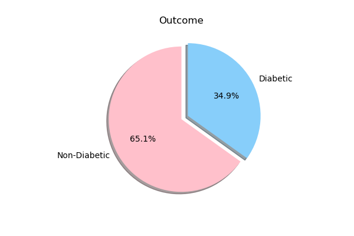
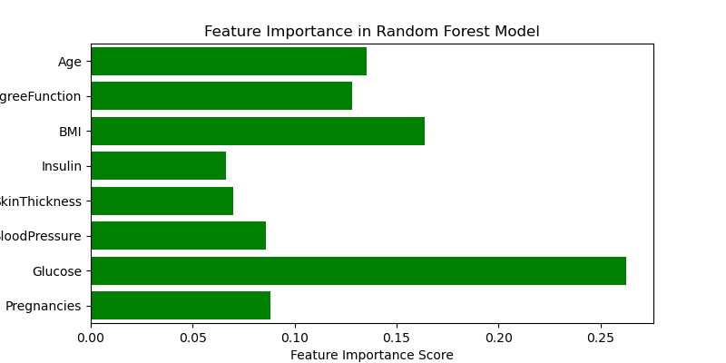

# Machine-Learning-Model-for-Diabetes-Prediction
Diabetes dataset is used to predict whether someone will develop diabetes over the next five years. Prediction is based on various Machine Learning models and shows the efficiency and reliability of AI models in early disease detection. 

## Overview: 
Diabetes is a chronic disease with long‑lasting effects, and early detection is crucial to help patients receive timely medical intervention and manage the condition effectively. I built this project to explore how machine learning can be applied to predict diabetes risk, with the goal of supporting preventative healthcare and encouraging healthier lifestyle changes before the disease develops.

### The real‑world problem it addresses:
In many cases, diabetes can be prevented if the risk is identified well in advance. By accurately outlining risk factors, patients and clinicians can take proactive steps to reduce the likelihood of developing the disease. This project uses the Diabetes dataset to predict whether someone will develop diabetes over the next five years. It frames the challenge as a binary classification problem, applying supervised machine learning to provide reliable predictions that could inform early interventions.

### What makes this project unique and impactful:
The project demonstrates the efficiency and reliability of AI models in early disease detection. A very thorough data preprocessing pipeline was implemented to ensure accuracy: missing values and duplication were addressed, outliers were handled using the Interquartile Range (IQR), and skewed features were transformed using log functions. As the dataset was imbalanced, appropriate measures were taken to balance the target variable ‘Outcome’ for more precise predictions. The code was developed in Jupyter Notebook using Python, with robust support from libraries such as Scikit‑learn, Pandas, NumPy, and Matplotlib. This combination of careful preprocessing, model experimentation, and reproducible coding makes the project impactful as a demonstration of how AI can contribute to preventative healthcare.

## Results & Key Insights:

### Performance Table:
The following chart summarises the performance metrics of six machine learning models applied to diabetes prediction.

 

Voting Ensemble achieved the highest recall (0.889), which is especially important in medical prediction because it helps minimise false negatives ensuring fewer at‑risk patients are missed.

Logistic Regression recorded the highest ROC AUC (0.833), showing strong overall discrimination between diabetic and non‑diabetic cases.

Random Forest delivered the best specificity (0.867), meaning it performed well in correctly identifying non‑diabetic cases and reducing false positives.

### Model Selection for next five years:
For next five years diabetes prediction, the Voting Ensemble model showed the highest recall (0.889), making it the most suitable for clinical data where identifying diabetic cases is critical. Even though Random Forest achieved the highest specificity, and Logistic Regression offered balanced performance with high interpretability, the Voting Ensemble strikes the best balance between sensitivity and overall predictive power, supporting its selection as the final model.

These results highlight how different models excel in different areas: some are better at catching positive cases, while others are stronger at ruling out negatives. Together, they demonstrate the value of comparing multiple approaches when tackling healthcare prediction problems.

## Model Evaluation:
### Stratified K-fold Validation:

Stratified K‑Fold cross‑validation is applied to evaluate model performance on unseen data. Rather than depending on a single train‑test split, each model is trained and tested across multiple folds, ensuring that every subset of the data is used for both training and validation. This approach provides a more reliable and robust estimate of how the models generalise to new cases.

 

### ROC Curve

To visualise the performance of all six ML models, the ROC Curve plots the True Positive Rate against the False Positive Rate across different classification thresholds. This comparison highlights that multiple models are capable of reliable classification, but the Voting Ensemble stands out by combining strengths across individual classifiers. A higher AUC means better ability to correctly identify both diabetic and non-diabetic cases, making this visual a key indicator of model effectiveness. 

## Dependencies 
pip install -r requirements.txt

## Dataset and Preprocessing:

The publicly available diabetes dataset has information on Pregnancies, Glucose, Blood Pressure, Skin Thickness, Insulin, BMI, Diabetes Pedigree Function, and Age. The target variable is titled as ‘Outcome’ which contains 0 and 1. In clinical data, 0 is normally considered equal to ‘No disease’ and 1 is equal to ‘disease’. 
The dataset contains 768 samples with nine numerical features (floats and integers). Initial analysis showed no duplicate rows, but several features had missing or zero entries.

In the ‘Pregnancies’ column, 111 entries were zero. These were retained, as they may represent male samples or females who haven’t been pregnant.

Zero values in Skin Thickness, Insulin, BMI, Blood Pressure, and Glucose were replaced with the median of each feature to reduce bias from skewness and outliers.

Outliers were visualised using box plots and assessed with Z‑scores. Since the dataset is small, rows with outliers weren’t removed. Instead, the Interquartile Range (IQR) method was used to cap extreme values in Insulin, SkinThickness, Pregnancies, BMI, and BloodPressure. This significantly improved data quality, and recalculated Z‑scores showed no extreme outliers.

To address skewed distributions, histograms were plotted and Log Transformation was applied to DiabetesPedigreeFunction, which showed moderate to high skewness. This step helped improve model performance, especially for algorithms sensitive to feature distribution (e.g., SVM, Logistic Regression).

### Correlation Matrix:
A Correlation Matrix is used to view the relationship between different features and the target variable. Key Findings of the correlation matrix are:

- Glucose has a strong positive correlation (0.49) with Outcome (Higher glucose = higher diabetes risk)
- BMI and Insulin also show moderate correlation with diabetes (0.31 and 0.27, respectively)
- Age and DiabetesPedigreeFunction are mildly correlated (0.24 and 0.18, respectively), i.e. older age and family history are contributing factors
- Pregnancies also have some link with diabetes (correlation of 0.22)
- BloodPressure and SkinThickness show weak correlation with Outcome, but are still relevant
- DiabetesPedigreeFunction is less correlated overall, but still relevant
- BMI and SkinThickness show a positive correlation (0.56) with each other. One is causing an increase in the other. Because Correlation is less than 0.8, both columns are kept for the model as they might make a unique contribution to the prediction of diabetes.

### Dependent Variable:
The dependent or target variable is labelled as ‘Outcome’.
Diabetic: 268
Non-Diabetic: 500
The outcome of this dataset is imbalanced, which is normally common in clinical data (more non-diabetic entries than diabetic). Overall, it's fair to say that the outcome is biased towards non-diabetic samples. The machine learning model is going to predict whether these people are likely to get diabetes in the next five years. 

### Train-Test and Standard Scaling:
First, the Independent (x) and dependent (y) variables are separated from the cleaned data frame.  By using the sklearn library, the data is split into train and test by using 70:30 split. The reason for 70:30 ratio is to ensure that the model has enough data to learn meaningful patterns during training. As this is medium-sized data, 30% is considered a fair amount of unseen data for the model to make any predictions.
Feature scaling is used to standardise the train and test split. Data Scaling is the standard machine learning method, and this is to ensure that features with different scales do not affect the model’s performance. The dependent variable is not standardised as it’s a binary classification target, and scaling is not necessary.

## Models:

### Ensemble Model
To enhance the predictive ability of the disease detection model, I combined the learning from multiple existing models to create an Ensemble Model. By integrating two or more classifiers, there is a strong potential to improve overall performance, particularly recall and F1 score. Since Logistic Regression, Balanced Random Forest Classifier, Random Forest, and SVC demonstrated consistently high accuracy, these models were selected to form the pipeline for the ensemble approach.

### Logistic Regression:
Logistic Regression is used as a baseline model because of its reliability in binary classification tasks (Diabetic vs Non-Diabetic). It works well with a moderate number of features. With class_weight = ‘balanced’, it can handle imbalanced data well by adjusting the penalties on misclassifications, and it seeks to minimise the cost function during training.
The Logistic Regression model achieved an accuracy of 74%, with a sensitivity (recall) of 70%, indicating it correctly identifies 70% of diabetic cases. The specificity of 76% shows that the model reliably identifies non-diabetic individuals. Having a high recall rate is important in medical data, where False Negatives can be more critical than False Positives. The precision and recall for the Non-Diabetic class(0) also suggest that the model is correctly identifying healthy individuals.

### Random Forest:
Random Forest is chosen as one of the classification models as it’s robust and can handle complex relationships in the data. It is an ensemble method that combines multiple decision trees for prediction. The feature importance map is used to visualise which features played an important role in the model’s prediction. Glucose, BMI and Age played an important role in the decision-making process for the Random Forest Classifier. 

The Random Forest model achieved an accuracy of 76%, demonstrating strong sensitivity (87%) in correctly identifying non-diabetic cases. However, its sensitivity for diabetic cases is lower (57%), suggesting that while the model is reliable in detecting non-diabetics, it may underperform in catching all positive cases, and this is an important consideration in disease prediction, where recall is often prioritised.

### Balanced Random Forest Classifier (BRF)
BRF from the imblearn library is used as it automatically balances the dataset by under sampling the majority class at each tree during training. The Balanced Random Forest model achieved an overall accuracy of 74%, providing balanced sensitivity and specificity across both classes. With a recall (sensitivity) of 64% for diabetic cases, the model is effective in identifying diabetic individuals, though precision suggests potential room for reducing false positives. There is a reliable balance between detecting diabetic patients and minimising false positives compared to the standard Random Forest model, which underperformed in detecting positive cases.

### XGBOOST
XGBoost (eXtreme Gradient Boosting) is selected for its robust performance with tabular data. It efficiently handles complex and non-linear relationships. The XGBoost model achieved an accuracy of 73%, with stronger performance in predicting non-diabetic cases. Its recall (sensitivity) for diabetic patients is 58%, which indicates that the model could be improved for identifying positive cases with some adjustments.

### Support Vector Classifier (SVC)
SVC is very effective in high-dimensional spaces. It is suitable for binary classification, and it aims to find the optimal boundary that maximally separates the classes. It achieved an overall accuracy of 74%, performing better in identifying non-diabetic individuals with a recall of 86%. However, recall for diabetic patients is relatively lower at 52%, suggesting the model may need refinement or threshold tuning to reduce false negatives in diabetic predictions.

## Future Work
- Deploy the model as a web app for clinical use.
- Explore deep learning models for improved recall.
- Expand dataset for better generalisation.

## Acknowledgements
- Dataset: Pima Indians Diabetes Database (UCI ML Repository).
- Libraries: scikit-learn, pandas, numpy, matplotlib, seaborn, xgboost.

## License
This project is licensed under the MIT License.

## Contact
Created by Zubeen Khalid! 
Feel free to connect on [LinkedIn](www.linkedin.com/in/zubeenkhalid) or explore more projects on [GitHub](https://github.com/zubeen84).

